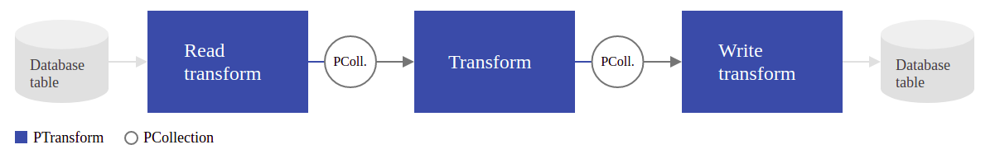
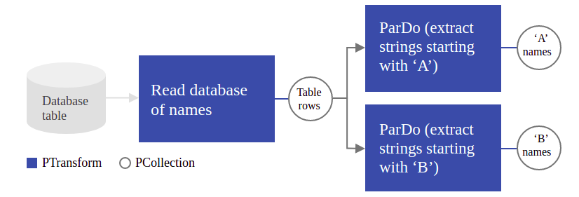

# gcloud-dataflow
Google dataflow sample.

## Wiki

### `PColection`

La abstracción de `PCollection` representa un conjunto de datos de elementos múltiples distribuidos. Puede pensar en una PCollection como datos de "canalización". Apache Beam usa a PColection para transformar los datos en otros PColection de acuerdo al pipeline que se este ejecutando.

### Transformaciones

```python
[Output PCollection] = [Input PCollection] | [Transform]
```



```python
[PCollection of database table rows] = [Database Table Reader] | [Read Transform]
[PCollection of 'A' names] = [PCollection of database table rows] | [Transform A]
[PCollection of 'B' names] = [PCollection of database table rows] | [Transform B]
```



#### `ParDo`

ParDo es una transformación Beam para procesamiento paralelo genérico. El paradigma de procesamiento ParDo es similar a la fase "Map" de un algoritmo de estilo Map / Shuffle / Reduce: una transformación ParDo considera cada elemento en la PCollection de entrada, realiza alguna función de procesamiento (su código de usuario) en ese elemento y emite cero , uno o varios elementos a una PCollection de salida.

* **Filtrar un conjunto de datos**. Puede usar ParDo para considerar cada elemento en una PCollection y enviar ese elemento a una nueva colección o descartarlo.
* **Formatear o convertir cada elemento en un conjunto de datos**. Si su PCollection de entrada contiene elementos que son de un tipo o formato diferente al que desea, puede usar ParDo para realizar una conversión en cada elemento y enviar el resultado a una nueva PCollection.
* **Extraer partes de cada elemento en un conjunto de datos**. Si tiene una PCollection de registros con varios campos, por ejemplo, puede usar un ParDo para analizar solo los campos que desea considerar en una nueva PCollection.
* **Realizar cálculos en cada elemento de un conjunto de datos**. Puede usar ParDo para realizar cálculos simples o complejos en cada elemento, o ciertos elementos, de una PCollection y generar los resultados como una nueva PCollection.

##### Creando un DoFn

El objeto `DoFn`  que pasa a `ParDo` contiene la lógica de procesamiento que se aplica a los elementos de la colección de entrada. Cuando usa Beam, a menudo las piezas de código más importantes que escribirá son estos `DoFns`: son los que definen las tareas de procesamiento de datos exactas de su canalización.

#### `GroupByKey`

`GroupByKey`es una transformación Beam para procesar colecciones de pares clave / valor. Es una operación de reducción paralela, análoga a la fase Shuffle de un algoritmo de estilo Map / Shuffle / Reduce.

```
cat, 1
dog, 5
and, 1
jump, 3
tree, 2
cat, 5
dog, 2
and, 2
cat, 9
and, 6
...
```

```
cat, [1,5,9]
dog, [5,2]
and, [1,2,6]
jump, [3]
tree, [2]
...
```

#### `CombineValues`

Combina un iterable de valores en una colección de elementos con clave.

```python
import apache_beam as beam

with beam.Pipeline() as pipeline:
  total = (
      pipeline
      | 'Create produce counts' >> beam.Create([
          ('🥕', [3, 2]),
          ('🍆', [1]),
          ('🍅', [4, 5, 3]),
      ])
      | 'Sum' >> beam.CombineValues(sum)
      | beam.Map(print))
```

```
('🥕', 5)
('🍆', 1)
('🍅', 12)
```

## Referencias

* https://beam.apache.org/documentation/programming-guide/
* https://cloud.google.com/dataflow/docs/quickstarts/quickstart-python
